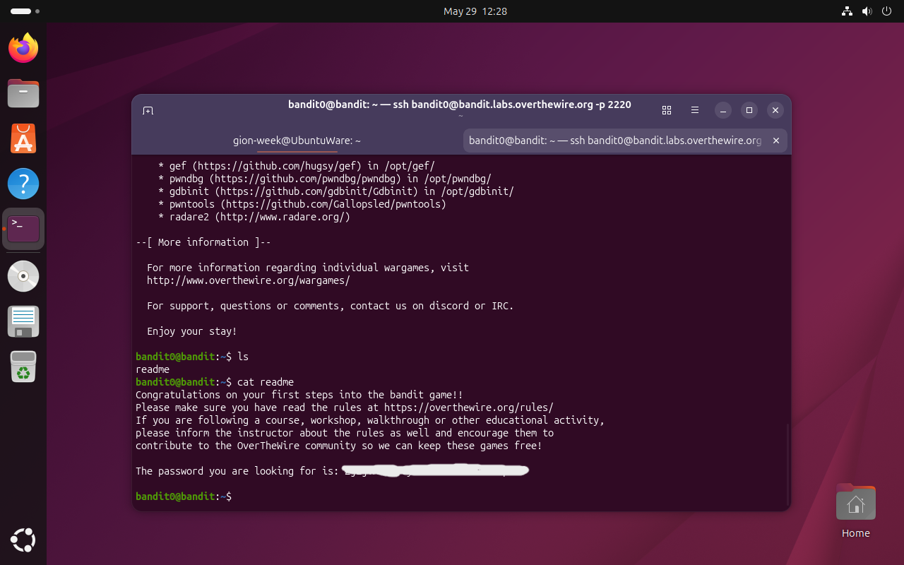

# Bandit Level 0 → 1

## Obiettivo

> *Il fine di questo livello è effettuare l'accesso al gioco utilizzando SSH. L'host a cui devi connetterti è bandit.labs.overthewire.org, sulla porta 2220. Il nome utente è bandit0 e la password è bandit0. Una volta effettuato l'accesso, vai alla pagina del Livello 1 per scoprire come superare il Livello 1.
---

## Informazioni di connessione

| Campo | Valore |
|-------|--------|
| Host | `bandit.labs.overthewire.org` |
| Porta | `2220` |
| Utente | `bandit0` |
| Password | `bandit0` |

```bash
ssh bandit0@bandit.labs.overthewire.org -p 2220
```

---

## Comandi / concetti utili

- `ssh` — connessione remota sicura
- `ls` — lista file nella directory corrente
- `cat` — stampa il contenuto di un file

---

## Soluzione

Il sito di OverTheWire fornisce direttamente le credenziali per il Level 0:

- **Utente:** `bandit0`
- **Password:** `bandit0`

Per connettersi, è sufficiente eseguire il comando SSH specificando utente, host e porta:

```bash
ssh bandit0@bandit.labs.overthewire.org -p 2220
```

Al prompt della password si inserisce `bandit0`. Una volta autenticati, si accede alla shell remota del server come utente `bandit0`.

### Step 2 – Individuare i file presenti

Una volta connessi, si lista il contenuto della home directory:

```bash
bandit0@bandit:~$ ls
readme
```

È presente un unico file chiamato `readme`.

### Step 3 – Leggere il file e ottenere la password

```bash
bandit0@bandit:~$ cat readme
```

Il file contiene la password per accedere al livello successivo (`bandit1`).



---

## Note e osservazioni

**SSH (Secure Shell)** è un protocollo di rete che permette di aprire una sessione di shell su una macchina remota attraverso un canale cifrato. Funziona su architettura client-server:

- il **client** (la propria macchina) invia una richiesta di connessione
- il **server** (la macchina remota) autentica il client e, se l'autenticazione ha successo, apre una sessione interattiva

La comunicazione è cifrata end-to-end tramite crittografia asimmetrica: durante l'handshake iniziale le due parti negoziano le chiavi di sessione, dopodiché tutti i dati trasmessi (comandi, output, password) sono illeggibili a eventuali intercettatori.

L'autenticazione può avvenire in due modi principali:
- **Password** — come in questo livello, si fornisce la password dell'utente remoto
- **Chiave pubblica/privata** — il client dimostra di possedere la chiave privata corrispondente a una chiave pubblica già registrata sul server (metodo più sicuro e consigliato in produzione)

La porta standard di SSH è la `22`; OverTheWire usa la `2220` per convenzione propria, da specificare con il flag `-p`.
